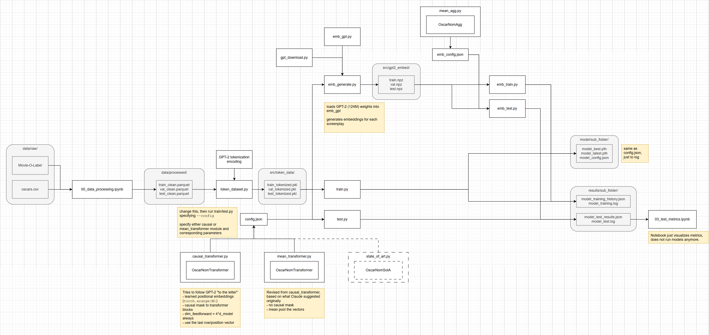
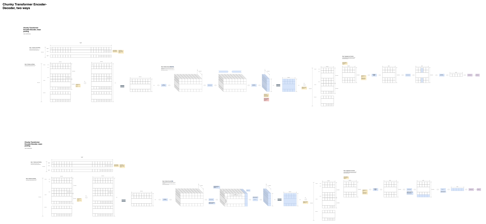
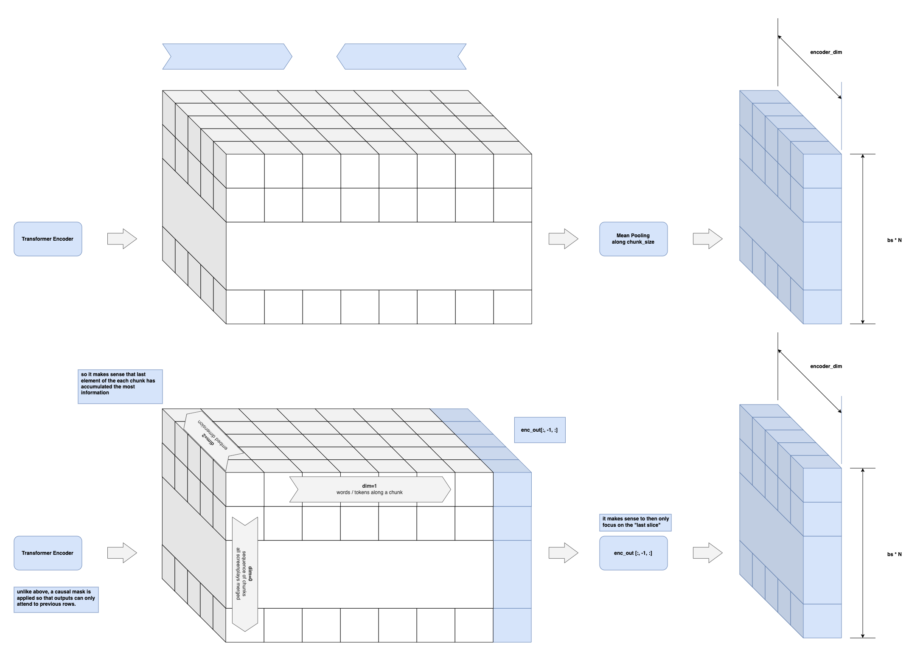
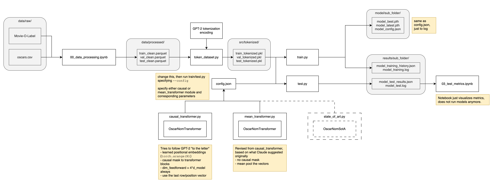

# Development Log

## 2026-05-05

Documenting how things work now that I've reached a major milestone in this project, but might come back to this later with more better neural net architectures and training methods.

First the `src` folder:

After data is cleaned and processed in `data` folder outside of `src` it is processed further as either token IDs (`token_data/` folder) or GPT-2 (124M) embeddings, dim=768 (`gpt2_embed/` folder)

```
root/
├── src/
│   ├── token_data/
│   ├── gpt2_embed/
|   |   └─ 124M/
│   ├── gpt2_embed/
│   ├─ token_dataset.py
│   ├─ gpt_download.py
│   ├─ emb_gpt.py
│   ├─ emb_generate.py
...
```

`token_dataset.py` transforms processed dataset into token IDs, saving in the `token_data` folder. Then the `emb_generate.py` script uses the GPT-2 model (`emb_gpt.py`) with pre-trained weights (`gpt2/` folder) to generate the embeddings for each screenplay, saving to `gpt2_embed/` folder

Two sets of files exist in `src`, one set for training/testing on token IDs, another set for GPT-2 embeddings.

For token ID data, the relevant files are:

```
root/
├── src/
│   ├── token_data/
│   ├── standalone/
│   ├─ datasets.py
│   ├─ token_dataset.py
│   ├─ causal_transformer.py
│   ├─ mean_transformer.py
│   ├─ config_causal.json
│   ├─ config_mean.json
│   ├─ train.py
│   ├─ test.py
│   ├─ train_test.sh
...
```

`train.py` and `test.py` report to Weights and Biases project if ` "wandb": {"enabled": true}` is defined in the config. Versions of these files that don't use weights and biases at all are in the `standalone/` folder (but you could just set `"enabled": false`...)

For GPT2 embeddings the relevant files are:
```
root/
├── src/
│   ├── gpt2_embed/
│   ├─ datasets.py
│   ├─ mean_agg.py
│   ├─ emb_config.json
│   ├─ emb_train.py
│   ├─ emb_test.py
│   └─ emb_train_test.sh
...
```

`emb_train.py` and `emb_test.py` start with the embedding dataset in `gpt2_embed/` folder and trains/tests the `mean_agg.py` transformer model (basically the aggregator half of the `mean_transformer` model).

This equates to the following pipeline:



### Future Work

- other neural nets (BERT, Longformer, Mamba)
- other tokenizations besides GPT-2's encoding
- address class imbalance beyond cross entropy loss class weights and threshold tuning
- look into causes for threshold tuning according F-1 score and how that may result in very low decision thresholds (1-4%)
- refer to research document [here](./docs/research/class_imbalance_v0.md)
- focus on labeling based on whether the screenplay itself got an Oscar nomination, rather than Oscar nomination or win for some other category.
- hyperparameter tuning with Raytune and Weights and Biases

## 2026-05-03

Ran a lot of sweeps looking at different model and training hyperparemtners (in the `docs/design/` folder).

## 2026-04-29

**TODOS:**
- [x] Add additional classification metrics to display at the end of `test.py`
- [x] Diagnose why time/epoch is increasing.
- [x] Modify `train.py` to also use AUC/F-1 as basis for selecting best model
- [x] Use mixed precision (`train.py`)

- [x] Set up W&B
- [x] Start with 5 epoch learning rate schedule
- [x] Run smaller config training
- [x] Run GPU temperature logging in separate terminal
- [x] See results on W&B
- [x] Run original large config training
- [x] Run GPU temperature logging in separate terminal
- [x] See results on W&B


## 2026-04-28

Circling back to this...

Couple thing I'm most interested in doing:
- ~~Revisit chunky transformer model~~
- ~~Figure out how `train.py` can take any arbitrary model architecture and train it~~
- ~~See what it would take to train models on W&B~~ + RunPod
- ~~Look at distributions of words in the dataset: are there words that show up more frequently in Oscar nominated films or not?~~
- ~~A similar question can be asked for the model predictions~~ (i.e. "the model seems to think that words X, Y, Z increase probability...")

### Chunky Transformer Revisit

Did a visual documentation of how the current chunky transformer model works. While I think it's OK, it feels like it works differently than how I originally imagined it to work. And it feels like the mean pooling is doing a lot of heavy lifting to compress things.

It just bothered me that mean pooling was "compressing" sequences when I had used transformers before to "compress into vector" without having to resort to mean pooling...so how did I do it?

It took me awhile to draw out how everything goes from a sequence of tokens for each screenplay into tensors of all shapes and sizes...



From Raschka's *Building LLMs from Scratch* book chapter on classification fine tuning I realized that one alternative to mean pooling was to use a causal attention mask on the transformer and then look at the last row/slice.



Originally (above) the transformer blocks (both encoder and aggregator) did not use a causal mask, so all outputs of the chunk sequence could attend to each other. A causal mask forces outputs to only attend to previous outputs, thereby "accumulating" information to the last output. Then it would only make sense to look at the last slice before passing to aggregator modules or classification head.

So I wrote two different transformer models, `mean_transformer.py` and `causal_transformer.py`, to implement the above "compression methods."

Will revisit this some more later, since neither of the above two ways of "compressing sequences" is better than the other, depends on the situation. I am more interested in causal transformer but only because for now I am curious about the "limits of GPT-2."

But first a recap of what the `src` and `notebooks` files are doing and how they relate to each other in a pipeline...


### Pipeline Revisit

After reviewing the janky/messy way I set up the code for some quick model training/test runs, I re-organized and revised files to work in the following pipeline.



The basic idea is that now `train.py` and `test.py` can take whatever model architecture is defined in any separate Python file, define it with hyperparameters, and train with specific parameters, all defined in a `config.json` file.

Then the notebook is used only to visualize results rather than run models within them.

### Using GPT-2 pre-trained weights

Major change I think moving forward is to treat the pre-trained GPT-2 model as a script embeddings "generator." The GPT-2 model should just go through the entire dataset chunk by chunk, however big the context window allows, and generate 768-dim or w/e dim vector sequences...that another transformer model can then read/process to make Oscar nomination probability predictions.
- This would restrict the use of further fine-tuning the GPT-2 weights...
- But save GPU memory for testing a "full model" that involves frozen GPT-2 weights
- Initially the idea of "loading GPT-2 weights, then freeze, then train/finetune new layers" seemed like the right idea following Raschka's Building LLMs from Scratch classification example. But that's only OK for "small sequences" (though even then, computing the same numbers with frozen weights from an LLM is wasteful) or really "demo examples for beginners"

So the "big matchup" in my mind for now is the `causal_transformer` trained from scratch vs the same `aggregator` within causal transformer architecture being fed GPT-2 generated screenplay embeddings. Specifically:
- Train/hyperparameter tune `causal_transformer` from scratch
- (likely needed but not "the plan": switch the causal_transformer's `aggregator` half to NOT use the causal mask)
- Then use GPT-2 pre-trained weights to generate screenplay embeddings.
- Then, take the same aggregator half architecture but feed it the GPT-2 embeddings. 
  - The aggregator can be trained from scratch using the same hyperparameters as the `causal_transformer` architecture's aggregator
  - OR the aggregator can have its weights initialized to whatever the best `causal_transformer` weights are. 

If there is some meaningful improvement in performance on the test dataset, this would indicate some "value add" from GPT-2's pretrained weights. (it's a big IF)

## 2026-03-07

Freezing GPT-2 weights is probably the way to go but for future reference/consideration, Raschka also unfroze the last transformer block/layer for classification fine-tuning:

```python
# UNFREEZE last transformer block and layer norm
for param in model.trf_blocks[-1].parameters():
    param.requires_grad = True

for param in model.final_norm.parameters():
    param.requires_grad = True
```
(but this might run the risk of out-of-memory as well)

A single sample takes about a 2 min (batch_size=2 runs out of CUDA memory):
- 1320 samples in training
- Typically only 10 epochs
- So... 10 x 1320 x 2min = a very long time (440 hrs)
- We can try to cut back with just seeing performance after two epochs = 88 hrs
- That still takes forever so we could consider cutting back the number of samples per epoch and randomly choosing them.
- If we only look at 100 random samples per epoch: 3 x 100 x 2min = 10 hrs (three epochs)

For a very controlled experiment this should carry back over to the training for the chunky transformer.

Until I can see if using cloud GPU resources might make things faster, hyperparameter tuning via Raytune also feels like overkill for now.

### Post Script

Not sure **loading** the GPT-2 model weights is the way to go. Keyword is loading the weights onto a GPU. That means running all those computations for every screenplay sample every epoch, which takes a looong time.

I tried "random sub-sampling" to try to speed things up...but that means the models see even less data and the resulting performance is terrible.

Loading GPT-2 weights makes sense if you want to fine-tune some (or all) GPT-2 weights for a specific problem. But if you are going to keep all GPT-2 weights completely frozen during training, you might as well use GPT-2 to generate the embeddings for each screenplay before training, and then feed those embeddings as the "training samples" for any model architecture. See 2026-04-28 devlog entry.

## 2026-03-06

Things to consider for `OscarNomGPT` class
- Loading the GPT pretrained weights for `GPTModel` during `OscarNomGPT`'s initialization
- `GPTModel.out_head` has an output size = original vocab size, but this should be change to a new variable `output_size` and match up with `agg_d_model` for the TransformerEncoder that processes all the chunks.
- How that happens in conjunction with loading pre-trained weights is tricky, so refer to Raschka's LLM code.
- `cfg["emb_dim"]` for GPTModel should be the same as `config['enc_d_model']`

```python
self.out_head = nn.Linear(
            cfg["emb_dim"], cfg["enc_d_model"], bias=False
        )
```
- but if they are, the out_head for `GPTModel` is a bit redundant.
- The positional encoder for the encoder in `OscarNomTransformer` is probably not necessary since `GPTModel` will apply its own position encoding to the input now. 
- But the `agg_pos_enc` will remain as the sinusoidal positional encoder (this could be worth revisiting later)
- Basic test runs seem to suggest it's basically not possible to finetune the GPT-2 model weights on a 4090 laptop GPU because a single data sample is so big that the 12-headed, 12 layered "small" GPT-2 has to still compute all the chunks in a single forward pass, which can't fit on 16GB of memory.

Changes needed for `train.py`
- line 141-168 defines a config specific to the chunky transformer. to adapt this to chunky GPT, the `config` variable should be loaded from a separate JSON file or something
- line 221 specifically initializes `OscarNomTransformer` class model with the `config`. this will need to flexibly change between chunky transformer and chunky GPT
- alternatively, just rename `train.py` as `train_transformer.py` and then copy it as a separate version for `train_gpt.py` since the gpt model also needs to load pre-trained weights...(unless this can be done within the importing)
- same for `unit_train.py`

## 2026-03-05

Just had some time to come back to this.

After reviewing what I've done and thought about so far, some ideas:
- It's a bit unclear if the chunky transformer can do better than the hyperparameter and training settings I've tried so far, but worth exploring with some Raytune hyperparamter tuning.
   - Basically, if the chunky transformer's encoder (part that processes individual chunks of the entire movie scritp) has bigger dimensions, the prediction accuracy and precision improves but at the cost of lower recall and F-1 scores.
- I believe I still need to try using the pre-trained GPT-2 model weights in the chunky GPT-to-transformer decoder architecture idea. Will need to get this working in a separate branch.
- I've been meaning to consult Andrej Karpathy's recipe on training neural nets.
- And w.r.t. class imbalance I had Claude do some deep research and need to review that with the Appendix Section of Sebastian Raschka's *Building LLMs from Scratch* book.

## 2026-01-22

Alrighty, training loop now done. Claude suggested I add the following beyond the typical GPT training stuff I've learned:
- Add cosine annealing learning rate schedule, with a warm-up period of 10% of total steps.
- Gradient clipping to 1.0 to prevent exploding gradients

Assuming batch size of 4 for both training and validation (which ends up taking 11/16GB vRAM), a single epoch takes around 2 mins, so 100 epochs will take around 3-4 hours. Not bad!

But with the small batch size I'm curious how the test performance will actually turn out.

Also I still have yet to think about and deal with the class imbalance.

To be continued...

## 2026-01-21

Good news is the transformer code is now updated and works for a random sequence of 100k token integers.

Bad / OK news is that the batch size has to be set to 2, otherwise my laptop GPU runs out of memory.

Claude recommends two ways to deal with this:

**Option A:** Process chunks in a loop with gradient checkpointing. Each chunk is encoded sequentially, gradients are reconstructed during backward pass. Slower but memory-efficient.

**Option B:** Freeze the chunk encoder. Use a pretrained encoder (like the first 6 layers of BERT), run it in `torch.no_grad()`, only train the aggregator. Much faster, much less memory, and honestly might work just as well for your task.

Coincidentally Option B is sorta where I was headed already, but I wanted to use the pretrained GPT-2 and keep it frozen.

Of course in my mind, there is an **Option C**: Keep going! Keep the batch size to 2, there are only 1000 or so training samples and 400 or so validation samples.

My `unit_train.py` also works so I'm confident I can take a real movie script from the training script and give it to the `OscarNomTransformer` model in a training loop. Time to start training this thing!

## 2026-01-20

Finally had some time to circle back to this and refresh my memory on how a transformer's encoder and decoder works. As I was re-writing a boilerplate version a couple things stood out to me that seem to be tricky to change if I want the transformer to process chunks of a movie script into a sequence of embeddings and then decode it into two logits for binary classification.

- Encoder and Decoder will need different `d_model` parameters
   - They can also have different `nhead` and `dim_ff` parameters
   - With different `d_model` parameters, Encoder and Decoder will have different positional encoders
- The same `token_emb`/`nn.Embedding` is typically applied to both `src` and `tgt`.
   - instead the `tgt_emb` embedding going into the Decoder could just be a linear layer that processes the embedding sequence?
- The big question in my mind is how the `memory` that usually gets passed from Encoder to Decoder will happen, since what I think I want is the Encoder to pass an embedding sequence.
   - The other question is what is the `tgt` in this problem anyway? In machine translation, `tgt` starts out as the target language start token and slowly grows as the Transformer translates from source language to target language. But in this binary classification problem, we're not really doing something like that. So shouldn't target just be something arbitrary/blank/random noise?

Just wanted to get these specific questions clarified before I go back to asking Claude what to do next haha.

Next step is just to give Claude this boiler plate and my rough diagram of what I want the transformer architecture to end up looking like and have Claude walk through step by step what changes have to be made. (Note: not via Claude Code, I'm looking for a customized tutorial from Claude, not a one-shot vibecoded solution...not yet at least)

## 2026-01-15

Just took a few minutes to clean up and organize the data processing and exploratory data analysis notebooks and datasets.

Time to start coding a transformer, in my mind the "chunky transformer encoder-decoder" which has to take the movie script window chunk by window chunk first before predicting probability of Oscar nomination.

...and now I'm realizing that I need to take some more time to refresh my memory on the specific pieces of the transformer and GPT-2 so that I can build up towards something that can handle a movie script chunk by chunk. 

For today I'm just going to make sure the "basic puzzle pieces" are all here:
- a basic Transformer with separate encoder and decoders
- a GPT-2 model with pre-trained weights (courtesy of Sebastian Raschka's LLMs from Scratch book)

### TODOs for later

- [x] Get Chunky versions of transformer and GPT-2 to work. 
- [x] Make sure these are done in separate branches
- [x] Write a simple "unit test" script: load a random movie script in the training set and give it to a model. It should at least spit out a probability with no issues.
- [x] Exploratory data analysis of word frequencies in movie screenplays.
- [x] Consider ways to deal with the class imbalance during training.
- [x] Training-validation-test loops
- [ ] Use Raytune for tuning hyperparameters.

## 2026-01-14

Hello world!

This project is a revisit of this one-day hacking/pairing [project](https://github.com/minsun-ss/recurse-pairing) at the Recurse Center with other programmers. The goal is the same as before: Given a movie's screenplay text (and other metadata) predict whether that movie gets Oscar nominations or wins, using this HuggingFace [dataset](https://huggingface.co/datasets/Francis2003/Movie-O-Label).

Building on what we worked on before, I want to explore a few different approaches here. Will circle back and document them clearly after some brainstorming and chatting with Claude...

...and take some time to refresh my memory on important bits about the dataset:
- The HuggingFace dataset doesn't label which movies won an Oscar, but one of its [reference datasets](https://github.com/DLu/oscar_data) does, so the previous project made sure to clean the data in that aspect.
- There is significant class imbalance when it comes to Oscar nominations and wins: around ~19% of the movies got nominated, and ~4-5% actually won. This presents a serious challeng for a classifier model.
- Assuming a GPT-2 tokenizer (byte-wise encoding), the screenplays are on average 37k tokens long, ranging between 7k and **100k tokens**.
- During the last attempt, this became an issue because an entire script couldn't fit in the context window of a GPT all in one shot and hit my 4090 laptop GPU's memory limit.
- The dataset also contains script embeddings, which to me represents a compression of the input data to get things to fit into a smaller context window.

My basic "pie-in-the-sky" goals: 
- Don't use the dataset's script embeddings.
- Revisit how this could be done with:
    - Transformer Encoder and Decoder
    - pre-trained GPT-2 and Transformer Decoder
    - If I have time look at advanced Transformer-based models since GPT-2 (Longformer, Mamba)
- For funzies, give a whole script to an open source local LLM and:
    - Measure its classification performance out-of-the-box.
    - Figure out a way to fine tune it.

More realistically I'm thinking my goals/outcomes should be:
- Try the following without the dataset's script embeddings:
    - Transformer Encoder and Decoder
    - pre-trained GPT-2 and Transformer Decoder
- And if the performance still sucks, use the script embeddings to train the TransformerDecoder from scratch

The other "pie-in-the-sky" goals are beyond my current coding/ML knowledge since I haven't read those advanced transformer papers or learned how to code/re-tool existing LLMs...yet :D


### TODOs for later

- [x] Re-organize notebook files and datasets 
- [x] Exploratory data analysis of word frequencies in movie screenplays.

### Regarding AI-assisted workflows

I am starting off this project with two important aspects of Claude:
- Claude Projects where all my chats share a context in terms of instructions and other files.
- Claude Code which I plan to use to help quickly get some exploratory data analysis out of the way before diving into the ML model architecture and training myself.

I am also planning to use both Gemini Code Assist and Claude Code for help with coding the ML models as I am curious to see how they approach the coding differently.

It may be valuable for others to note my Claude Project instructions here:

```
# Role and Purpose

You are a fellow ML research engineer on this project.

## Context

- Given a movie's screenplay text (and other metadata) predict whether that movie gets Oscar nominations or wins.
- This amounts to a binary classification problem.
- Dataset: https://huggingface.co/datasets/Francis2003/Movie-O-Label

## My Goals

- Experiment with various transformer, GPT, and LLM related ways to classify the movie scripts.

## General Behavior

- Be a helpful research collaborator. Balance giving advice presuming an approach that I am interested in with occasional challenges to approach an ML problem differently.
- Prioritize comments on how to improve the model's acccuracy.

## Output Preferences

- **Style:** Explain in the style of Andrej Karpathy.

## Key Constraints and Limitations

- Do NOT provide code snippets beyond what I ask for.
- Always assume I am working with a decent CUDA-enabled laptop GPU (RTX 4090 with 16GB vRAM)
- Again it's the laptop GPU, not the desktop PC GPU.
- When uncertain: Suggest ways cloud GPU computing resources may be required, with a clear detailing of the costs.
```