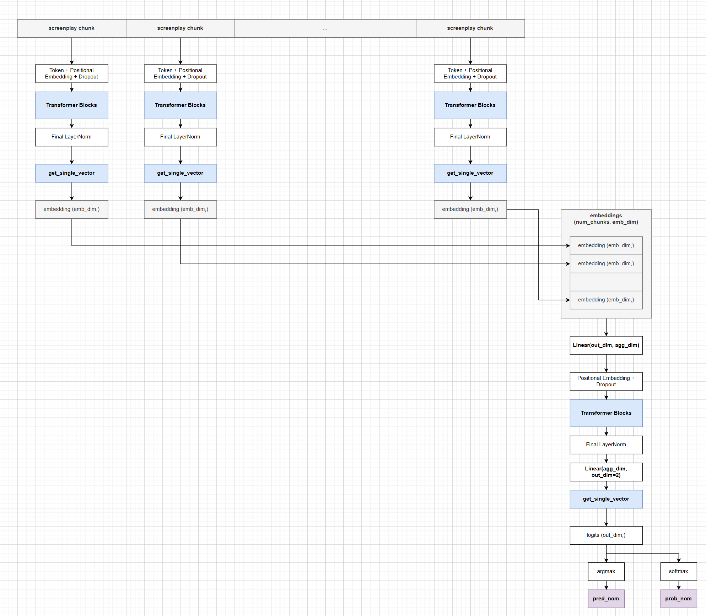
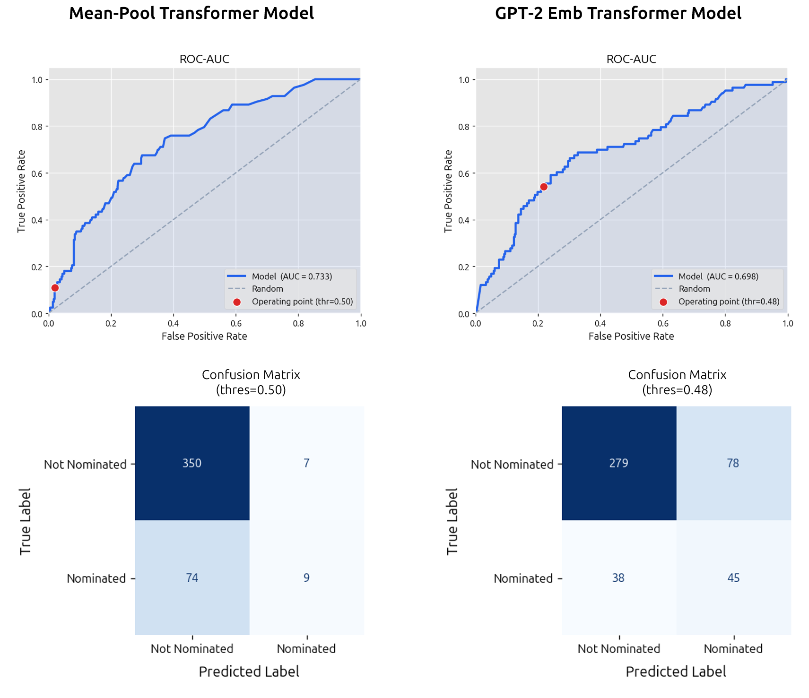
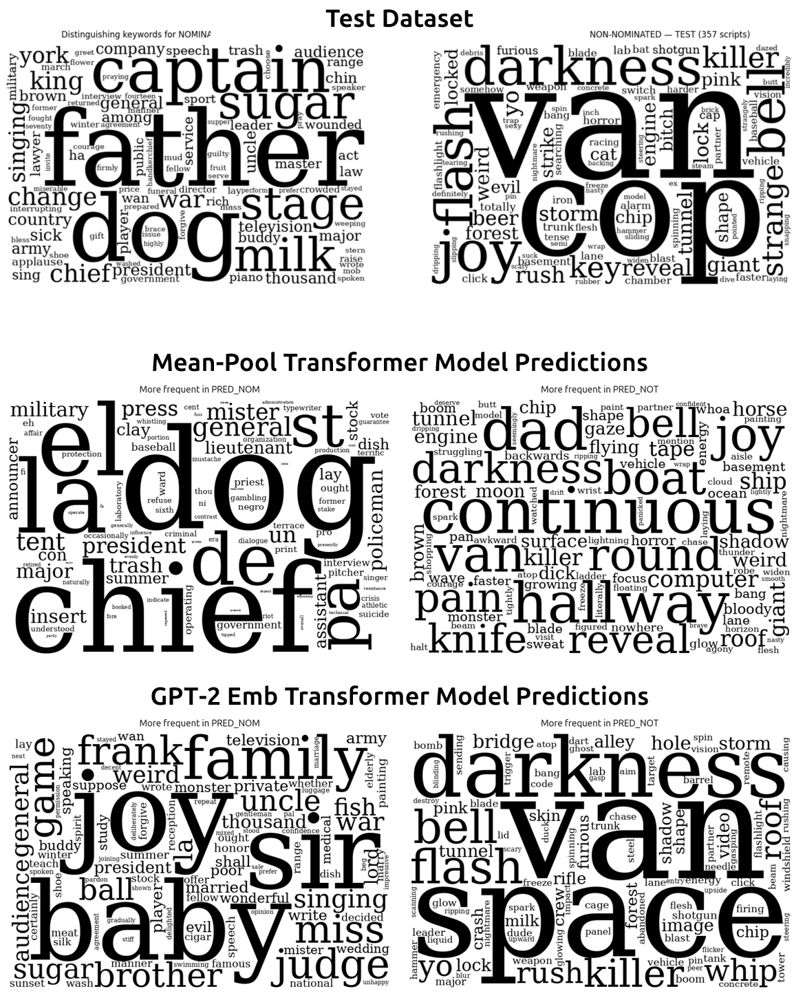

# oscar_nom_win

This project is an attempt to predict whether a movie gets an Oscar nomination or win based on its screenplay.

## Background

During my recent batch at [The Recurse Center](recurse.com), a study group around Sebastian Raschka's *Building LLMs from Scratch* book got interested in other datasets, particularly inspired by the Classification Fine-tuning chapter of the book where a GPT-2 pretrained model is finetuned to classify spam messages. I came across this [dataset](https://huggingface.co/datasets/Francis2003/Movie-O-Label) on HuggingFace and tried (and failed) to beat the baseline model classification metrics shown with the dataset.

Specifically, I was interested in two approaches and one key constraint:
- Training a basic transformer model from scratch.
- Training another transformer model that uses GPT-2 pre-trained weights somehow, and see how the performance
- Do it all on a laptop RTX 4090 GPU (16GB vRAM)

I wasn't yet interested in chasing state of the art architectures and methods, I just wanted to understand the limits of basic architectures.

## Dataset

Training-validation-test samples: `(1320, 440, 440)`

Imbalance percent nominations/wins:

```
train: 18.94% nominated for Oscar in best screenplay
val: 19.09% nominated for Oscar in best screenplay
test: 18.86% nominated for Oscar in best screenplay
```

```
train: 4.39% won Oscar for best screenplay
val: 4.09% won Oscar for best screenplay
test: 5.00% won Oscar for best screenplay
```

So basically, a nomination model that achieves 81.14% accuracy on the test dataset could just be predicting "not nominated" for every screenplay. 

See [data_notes](./data/data_notes.md) for more info.

For now, I'm interested in:
- use only the screenplay text, ignore metadata and summary
- predict Oscar nomination label only, not Oscar wins.

## Neural Network Architecture

I eventually settled on the same basic architecture but with key variations:



**Basic approach**
1. Breakdown each long screenplay into chunks.
2. "Encode" each chunk into an embedding vector. While a Transformer Block outputs a 2D matrix for each screenplay chunk, the 2D matrix is then transformed into a single embedding vector (`get_single_vector`) based on a choice of operations (mean-pooling, last slice, etc, see below)
3. Each screenplay basically gets "compressed" into a stack/sequence of embedding vectors
4. "Aggregate" the stack of embedding vectors with another transformer module to predict logits for nominated/not nominated for an Oscar.

Three specific variations were explored:
- `causal_transformer` applies a causal mask in all Transformer Blocks (encoder and aggregator) and then isolates the last vector (i.e., `get_single_vector` is just slicing the last position of the transformer block output `out[:, -1, :]`). This is consistent with how GPT-2 works.
- `mean_transformer` instead doesn't use a causal mask but instead performs mean-pooling on the transformer blcok outputs (i.e., `get_single_vector` is `out.mean(dim=1)`)
- `emb_gpt + mean_agg` uses GPT-2 (124M) to act as encoder and generate the embedding vectors. Then a mean-pool transformer module aggregates and predicts like in `mean_transformer`

The first two variations were trained where all parameters were trainable. The third variation used generated GPT-2 embeddings throughout training, essentially testing an full architecture were the only the aggregator is trainable and the GPT-2 model weights are frozen.

Early tests comparing causal and mean-pooled transformers found that mean-pooling resulted in consistently higher AUC metrics. So mean-pooling became the preferred variation to explore for the aggregator using GPT-2 embeddings.

## Results

After quite a few model and training hyperparameter tests, here are the latest test dataset classification metrics for predicting Oscar nominations.

| Name | AUC | Accuracy | Macro F1 | threshold | embeddings |
|---|---|---|---|---|---|
| logreg_baseline | **0.790** | 0.759 | **0.664** | 0.52 | sentence_transformers |
| causal_transformer | 0.693 | 0.766 | 0.623 | 0.50 | - |
| mean_transformer | 0.733 | **0.816** | 0.539 | 0.50 | - |
| gpt2_emb_agg | 0.698 | 0.748 | 0.637 | 0.48 | gpt-2 (124m) |

Overall, the performance is close but not quite better than baseline in the key metrics, AUC and Macro-F1. I'll refrain from drawing major conclusions but I think it's time to move on to other architectures.

Parameters for reference:

| Name | enc_d | enc_h | enc_L | agg_d | agg_h | agg_L |
|---|---|---|---|---|---|---|
| causal_transformer | 128 | 8 | 2 | 128 | 8 | 2 |
| mean_transformer | 96 | 8 | 2 | 96 | 4 | 2 |
| gpt2_emb_agg |768| 12 | 12 |256| 8 | 4 |

Qualitative comparison on mean-pooled transformer and aggregator using GPT-2 embeddings:



More results can be found in the notebooks for the [transformer](./notebooks/04_best_trf_metrics.ipynb) and [GPT-2 embedding](./notebooks/04_best_gpt2emb_metrics.ipynb) based models.

## Interpreting Model Predictions

Towards an interpretation of model's predictions, the frequency of keywords in the screenplays was analyzed in terms of which "distinguishing" words show up much more often in Oscar-nominated screenplays than not (and vice versa). This amounts to a kind of "keyness analysis" from corpus linguistics.

First row shows a pair of word clouds for words that show up more often in test dataset Oscar-nominated screenplays relative to non-nominated (left) and more often in non-nominated screenplays relative to Oscar-nominated (right). The next two rows show who often words appear in screenplays predicted by different models as Oscar-nominated rather than not. 



On the face of these results, it seems that the mean-pool transformer is correctly picking up a signal from the word "dog" to predict a screenplay will be Oscar nominated. The GPT-2 embedding model is correctly picking up on the words "van" and "bell" to predict a screenplay will not be Oscar nominated. More analysis results can be found in this [notebook](./notebooks/04_prediction_word_exploration.ipynb).

While this does not offer a comprehensive understanding of what signals are guiding the model to make predictions, it does provide some keywords to look out for in future interpretability work.